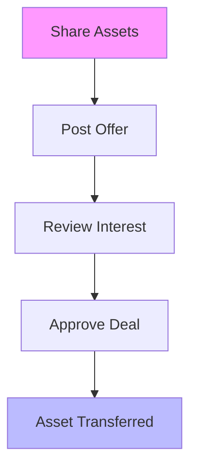

## Overview

Untapped Asset helps you uncover the value in your dormant digital assets like domains, websites, newsletters, and more. You maintain full control throughout the process, from sharing details to approving offers. This page outlines the key steps: telling us about your assets, posting offers, reviewing interest, and handling approvals.

<Columns cols={2}>
  <Card title="Tell Us About Your Assets" icon="search" href="#tell-us">
    Share details on your unused domains, sites, or other online properties to get matched with potential buyers.
  </Card>
  <Card title="Post Your Offer" icon="plus" href="#post-offer">
    List fixed-price offers or set terms for assets you control.
  </Card>
  <Card title="Review Interest" icon="eye" href="#review">
    Monitor inquiries and decide which opportunities to pursue.
  </Card>
  <Card title="Owner Approvals" icon="shield" href="#approvals">
    Approve or reject every transaction on your terms.
  </Card>
</Columns>

## End-to-End Process

Follow these steps to bring your assets into view.

<Steps>
  <Step title="Tell Us About Your Assets" icon="search">
    Connect your account and provide basic info about your domains, websites, newsletters, audiences, digital brands, creative IP, or content libraries.

    <Callout kind="info">
      Start with high-value assets like expired domains or underused newsletters.
    </Callout>
  </Step>
  <Step title="Post Your Offer" icon="plus">
    Create a listing with fixed price, terms, and description. Use our dashboard at `https://dashboard.example.com/assets/new`.
  </Step>
  <Step title="Review and Decide on Interest" icon="eye">
    Get notifications for matches. Evaluate buyer profiles and offers before responding.
  </Step>
  <Step title="Owner Control and Approvals" icon="shield">
    Finalize deals only when you approve. Nothing transfers without your explicit consent.
  </Step>
</Steps>



## Asset Types Supported

Different assets follow similar flows but with tailored listings.

<Tabs>
  <Tab title="Domains" icon="globe">
    List expired or parked domains with WHOIS details and appraisal value.

    ```json
    {
      "type": "domain",
      "name": "example.com",
      "price": 1500,
      "terms": "Transfer via escrow"
    }
    ```
  </Tab>
  <Tab title="Websites" icon="code">
    Offer sites with traffic stats and revenue history.

    ```json
    {
      "type": "website",
      "url": "https://mysite.com",
      "traffic": "10k monthly",
      "price": 5000
    }
    ```
  </Tab>
  <Tab title="Newsletters" icon="mail">
    Monetize subscriber lists with engagement metrics.

    ```json
    {
      "type": "newsletter",
      "subscribers": 5000,
      "openRate": "35%",
      "price": 2500
    }
    ```
  </Tab>
</Tabs>

## Owner Protections

<Callout kind="tip">
  You control every step. Buyers see only what you approve, and no asset moves without your sign-off.
</Callout>

<Expandable title="Advanced Approval Workflows" default-open="false">
  Customize rules like minimum offer thresholds or buyer verification requirements in your dashboard settings.
</Expandable>

## Best Practices

- Start with 3-5 assets to test the platform.
- Use clear descriptions and realistic pricing based on appraisals.
- Respond to interest within 48 hours to maximize opportunities.

<Columns cols={2}>
  <Card title="Quickstart" icon="rocket" href="/quickstart">
    Set up your account and list your first asset.
  </Card>
  <Card title="Asset Valuation" icon="trending-up" href="/valuation">
    Learn how to price your digital properties accurately.
  </Card>
</Columns>